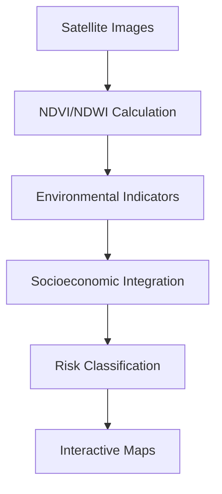

# 🌍 Environmental Risk Mapping

[](https://opensource.org/licenses/MIT)
[](https://www.python.org/downloads/)
[](https://earthengine.google.com/)
[](https://colab.research.google.com/github/seu-usuario/environmental-risk-mapping)

## 📌 Table of Contents
1. [Project Overview](#-project-overview)
2. [Data Sources](#-data-sources)
3. [Methodology](#-methodology)
4. [Installation](#-installation)
5. [Usage](#-usage)
6. [Examples](#-examples)
7. [Project Structure](#-project-structure)
8. [Contributing](#-contributing)
9. [License](#-license)
10. [Contact](#-contact)

---

## 🌐 Project Overview

Spatial analysis platform combining:

- 🛰️ **Satellite Imagery** (Landsat, Sentinel)
- 📊 **Socioeconomic Data** (IBGE, UN)
- 🌳 **Environmental Indicators** (Deforestation, Pollution)
- 🏙️ **Urban Metrics** (Heat Islands, Green Areas)

**Key Applications:**
- Climate change vulnerability mapping
- Environmental justice analysis
- Sustainable urban planning
- Disaster risk prevention

---

## 📊 Data Sources

| Source | Data Type | Resolution | Frequency |
|--------|-----------|------------|-----------|
| Landsat 8/9 | Multispectral | 30m | 16 days |
| Sentinel-2 | Vegetation Indices | 10m | 5 days |
| IBGE | Census Data | Sector level | Decennial |
| MapBiomas | Land Use | 30m | Annual |
| WorldPop | Population Density | 100m | Annual |

---

## 🧠 Methodology

### Risk Index Calculation
```python
risk_index = (0.3 * environmental) + 
             (0.4 * social_vulnerability) + 
             (0.3 * exposure)
```

### Processing Pipeline:


---

## ⚙️ Installation

### Requirements
- Python 3.9+
- Google Earth Engine Account
- 8GB RAM (16GB recommended)

### Quick Install
```bash
pip install enviro-risk-mapper
```

### Development Setup
```bash
git clone https://github.com/seu-usuario/environmental-risk-mapping.git
cd environmental-risk-mapping
pip install -e ".[dev]"
earthengine authenticate
```

---

## 🚀 Usage

### 1. Command Line Interface
```bash
enviro-map --location "Rio de Janeiro" --risk-type "flood" --output map.html
```

### 2. Python API
```python
from enviro_mapper import RiskAnalyzer

analyzer = RiskAnalyzer(
    location="Amazonas",
    indicators=["deforestation", "poverty"]
)
risk_map = analyzer.generate_map()
risk_map.save("amazon_risk.html")
```

### 3. Jupyter Notebooks
```python
# See notebooks/example_analysis.ipynb
```

---

## 🌳 Examples

### Case 1: Urban Heat Islands
```python
from enviro_mapper import HeatVulnerability

heat = HeatVulnerability("São Paulo")
results = heat.analyze(
    start_year=2015,
    end_year=2023
)
results.show_heatmap()
```

**Output Metrics:**
- Heat Risk Increase: 23% (2015-2023)
- Most Vulnerable Districts: Grajaú, Parelheiros

### Case 2: Deforestation Alert System
```python
alert = DeforestationMonitor()
alerts = alert.detect_changes(
    region="Legal Amazon",
    threshold=0.5  # 50% vegetation loss
)
alerts.export_to_shapefile()
```

---

## 🗂 Project Structure

```
environmental-risk-mapping/
├── data/
│   ├── raw/              # Satellite imagery
│   └── processed/        # Calculated indices
├── notebooks/
│   ├── case_studies/     # Example analyses
├── enviro_mapper/
│   ├── core/             # Analysis logic
│   ├── visualization/    # Mapping tools
│   └── earth_engine/     # GEE scripts
├── requirements.txt
└── README.md
```

---

## 🤝 Contributing

1. **Report Issues** via [issues](https://github.com/seu-usuario/environmental-risk-mapping/issues)
2. **Development Workflow**:
```bash
git checkout -b feature/new-indicator
git commit -m "Add water stress metric"
git push origin feature/new-indicator
```
3. **Coding Standards**:
   - PEP 8 compliance
   - Google-style docstrings
   - Unit tests for new features

---

## 📜 License

MIT License - See [LICENSE](LICENSE) for details.

```text
Copyright 2023 Environmental Risk Mapping Tool

Permission is hereby granted...
```

---

## 📧 Contact

**Research Team**  
[research@envirorisk.org](mailto:research@envirorisk.org)  

**Technical Support**  
[support@envirorisk.org](mailto:support@envirorisk.org)  

**Live Demo**  
[](https://share.streamlit.io/seu-usuario/enviro-risk-app)

---

💡 **For Policy Makers:**  
See our [Policy Brief Template](docs/policy_brief.md) for communicating results to decision-makers.

> **Note:** Always validate field data before policy implementation.
```

### Key Features:

1. **Multi-Source Integration**: Combines remote sensing with socioeconomic data
2. **Custom Risk Indices**: Weighted formulas for different environmental risks
3. **Policy-Ready Outputs**: Visualizations tailored for government use
4. **Scalable Analysis**: From neighborhood to continental scale
5. **Open Science**: Reproducible methods with open data

### Implementation Notes:

1. Requires GEE account for satellite data access
2. Pre-configured for Brazilian territories (adaptable globally)
3. Includes tutorials for common environmental risk scenarios
4. Outputs compatible with QGIS/ArcGIS
